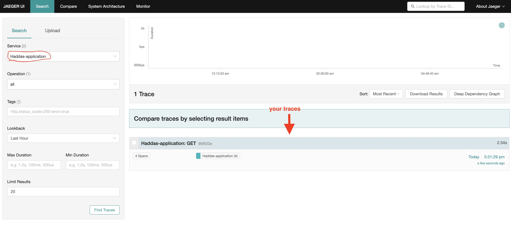

# cloudland2023-otel-workshop

A tutorial for how to monitor and troubleshoot applications in production using OpenTelemetry.
You will create a simple express server, then create a `tracer.js` file that uses OpenTelemetry components and will produces traces from your application. In the last step you will see you traces in Jaeger backend.

## Table of Contents

- [Prerequisites](#pre-requisites)
- [Step 1 - Build an express app](#step-1---build-express-app)
- [Step 2 - Create a tracer](#step-2---create-a-tracer)
- [Step 3 - Use tracer.js in the app](#step-3---use-tracerjs-in-the-app)
- [Step 4 - Do you have docker installed? Let's work locally](#step-4---do-you-have-docker-installed-lets-work-localy)
- [Step 5 - Automatic instrumentations](#step-5---automatic-instrumenations)
- [Step 6 - Create a span manually](#step-6---create-a-span-manually)

## Pre requisites

1. IDE - We prefer to use VSCode for a better experience (other IDEs are fine)
2. npm
3. node
4. docker is optional (enables you to do the advanced part of this tutorial)

## Step 1 - Build an express app

1. Create a new folder named otelWorkshop and `cd` into it.
2. Copy this `package.json` to you `otelWorkshop` folder:

   ```bash
    {
        "name": "cloudland-otel-workshop",
        "version": "1.0.0",
        "description": "An appllication to demonstrate OpenTelemetry capabilities",
        "license": "MIT",
        "dependencies": {
            "axios": "^1.4.0",
            "express": "^4.18.2",
            "got": "11.8.1",
        }
    }

   ```

3. Create a new folder otelWorkshop/src and copy `app.js` to there. `app.js` is an express server:

    ```javascript
    //app.js
    const express = require('express');
    const got = require('got');

    const WEATHER_API_URL = 'https://weather.workshop.epsagon.com/weather';
    const NEWS_API_URL = 'https://news.workshop.epsagon.com/news';
    const FACT_API_URL = 'https://facts.workshop.epsagon.com/facts';

    function getWeather(city = '') {
    const URL = `${WEATHER_API_URL}/${city}`
        return got(URL).json().catch((err) => null); // json
    }
    function getNews(city = '') {
        const URL = `${NEWS_API_URL}/${city}`
        return got(URL).json().catch((err) => null); // json
    }
    function getFactForToday() {
        const d = new Date();
        const month = d.getMonth() + 1;
        const day = d.getDate();
        const URL = `${FACT_API_URL}/${month}/${day}`;
    return got(URL).text().catch((err) => null); // string
    }

    const app = express();
    app.get('/digest/:city', async (req, res) => {
        const city = req.params.city;
        const [weather, news, fact] = await Promise.all([
                getWeather(city),
                getNews(city),
                getFactForToday()
            ]);
        res.json({ weather, news, fact });
    });

    app.get('/proxy/:city', async(req, res) => {
        res.json(await got(`http://localhost:3000/digest/${req.params.city}`).json().catch((err) => null))
    })

    app.get('/', async(req, res) => {
        res.send('choose a city, and go to http://localhost:3000/proxy/:city to get information about it')
    })

    app.use('*', (req, res) => {
        res.status(404).send('Not Found');
    })
    app.listen(3000, () => console.log('App is running at http://localhost:3000'));
    ```

4. Take a minute to look at this file. It is an express server that listens to `/` and to `/proxy/:city`
5. From `otelWorkshop/`, run `npm install`. verfy that `node_modules` and `package-lock.json` were generated.
6. Run the app! `node src/app.js`
7. You should see the log `App is running at http://localhost:3000"`
8. In you browser, go to <http://localhost:3000> and make sure you get a response.

## Step 2 - Create a tracer

In this step, we will create a file called `tracer.js`. This file uses open telemetry API in order to get traces about the actions our app does. We will build it step by step.

1. Create a new empty file: `otelWorkshop/src/tracer.js`
2. Add to the file the following code snippets one after the other:

   **Add the required librearies:**

    ```javascript
    const { getNodeAutoInstrumentations } = require("@opentelemetry/auto-instrumentations-node");
    const { SemanticResourceAttributes } = require('@opentelemetry/semantic-conventions');
    const { OTLPTraceExporter } = require("@opentelemetry/exporter-trace-otlp-grpc");
    const { diag, DiagConsoleLogger, DiagLogLevel } = require('@opentelemetry/api');
    const { HttpInstrumentation } = require('@opentelemetry/instrumentation-http');
    const { registerInstrumentations } = require('@opentelemetry/instrumentation');
    const { NodeTracerProvider } = require('@opentelemetry/sdk-trace-node');
    const { SimpleSpanProcessor} = require('@opentelemetry/sdk-trace-base');
    const { Resource } = require('@opentelemetry/resources');
    diag.setLogger(new DiagConsoleLogger(), DiagLogLevel.DEBUG);
    ```

   **Create a tracer provider:** The `NodeTracerProvider` object is responsible for creating and managing the instance of the tracer - the component that manages the traces.
   Please note to enter your app name in the right place:

    ```javascript
    const provider = new NodeTracerProvider({
    resource: new Resource({
        [SemanticResourceAttributes.SERVICE_NAME]: '<enter you app name>'
    })
    });
    ```

    **Create exporter:** We will use `OTLPTraceExporter`, which sends the data to the collector in grpc protocol. The collector we use is openTelemetry Collector, which already runs on this aws machine: [http://52.102.225.118](http://52.102.225.118) on port 4317.

    ```javascript
    const exporter = new OTLPTraceExporter({
        url: 'http://52.201.225.118:4317' //grpc
    });
    ```

    **Create a processor:** give it our exporter so it will know where to send the traces after processing.

    ```javascript
    const processor = new SimpleSpanProcessor(exporter);
    ```

    Let the tracer provider know about the processor.

    ```javascript
    provider.addSpanProcessor(processor);
    ```

    Sets the instrumentations:

    ```javascript
    registerInstrumentations({
        tracerProvider: provider,
        instrumentations: [
            // two options here: one is to use getNodeAutoInstrumentations(),
            // which insludes all the instrumentation OTel currently has.
            // another option is using specific instrumentation objects with separated comma between them:
            new HttpInstrumentation()
        ],
    });
    ```

    Register the provider.

    ```javascript
    provider.register();
    ```

**Note what we did:** we used OTel SDK, created a procesor, chose a collector, and an exporter.
Now traces will be produces by OTel for each http request our application will get. Those traces will be sent to the collector we defined using the exporter we defined.

## Step 3 - use tracer.js in the app

Now we want that `app.js` will use our `tracer.js`

1. Install all the new libraries needed for `tracer.js`:

    ```bash
    npm install \
    @opentelemetry/auto-instrumentations-node \
    @opentelemetry/semantic-conventions \
    @opentelemetry/exporter-trace-otlp-grpc \
    @opentelemetry/api \
    @opentelemetry/instrumentation-http \
    @opentelemetry/instrumentation \
    @opentelemetry/sdk-trace-node \
    @opentelemetry/sdk-trace-base \
    @opentelemetry/resources
    ```

2. Run `node --require src/tracer.js src/app.js`
3. Choose a city and go to `http://localhost:3000/proxy/:city`
4. Verify you get an answer from the express server.
5. Now we want to see the traces that were produces because of this action!
6. Go to `http://52.201.225.118:16686/` - this is the port jaeger is listening to on our AWS machine.
   you should see Jaeger UI. Jaeger is the backend we used that stores & presents the traces.
7. To see your traces choose you application name under 'Services' and press 'Find Traces'.



## Step 4 - Do you have docker installed? let's work localy

Until now we used a collector and a backend (Jaeger) that runs on an already prepared AWS machine I created for you.
Now let's see how to run both the collector and Jaeger locally on your machine using docker.

1. copy this file to otelWorkshop/src/otel-config.yaml. This is a configuration file for open telemetry collector.

    ```yaml
    # otel-config.yaml
    receivers: # specifies how data gets into the Collector
      otlp:
        protocols:
          grpc:
          http:
    processors: # processors are run on data between being received and being exported
      batch: # a batch span processor waits for a batch of spans before it exports them
    exporters: # where to export the traces
      jaeger: # 1. to jaeger
        endpoint: jaeger-all-in-one:14250
        tls:
          insecure: true
      logging: # 2. to the logging
        loglevel: debug
    service: # configure what components are enabled in the Collector
      pipelines: # A pipeline = a set of receivers + processors + exporters
        traces: # here we define a traces pipline (you can also define metrics or logs pipelines)
          receivers: [otlp]
          processors: [batch]
          exporters: [logging, jaeger]
    ```

2. Copy this file to `otelWorkshop/src/docker-compose.yaml`. This will run the open telemetry collector and jaeger on our machine:

    ```yaml
    version: "2"
    services:

    # Jaeger
    jaeger-all-in-one:
        image: jaegertracing/all-in-one:latest
        ports:
            - "16686:16686"
            - "14268"
            - "14250"

    # Collector
    otel-collector:
        image: otel/opentelemetry-collector-contrib:0.61.0
        command: ["--config=/etc/otel-config.yaml", ""]
        volumes:
          - ./otel-config.yaml:/etc/otel-config.yaml
        ports:
            - "1888:1888"   # pprof extension
            - "13133:13133" # health_check extension
            - "4317:4317"   # OTLP gRPC receiver
            - "55679:55679" # zpages extension
        depends_on:
            - jaeger-all-in-one
    ```

3. from `otelWorkshop/src` run `docker-compose up`.
4. change the ip of OTLPTraceExporter url to: `'http://127.0.0.1:4317'`. This is because now the collector is running on you machine.
5. Now repeat the steps we did before:
6. Run the app `node --require src/tracer.js src/app.js`
7. Choose a city and go to `http://localhost:3000/proxy/:city`.
8. Verify you get an answer from the express server.
9. Now go to Jaeger at you localhost: `http://localhost:16686/` and verify you see your traces.

## Step 5 - Automatic instrumenations

Sometimes you don't need or want to write a `tracer.js` on your own. In that case you can use "automatic instrumentations" which uses an already prepared tracer file:

1. export the following environment variables:

   ```bash
   export OTEL_TRACES_EXPORTER="otlp"
   export OTEL_EXPORTER_OTLP_ENDPOINT=“http://52.201.225.118:4317"
   export OTEL_EXPORTER_OTLP_PROTOCOL=grpc
   export OTEL_NODE_RESOURCE_DETECTORS="env,host,os"
   export OTEL_SERVICE_NAME="your-service-name" #Note: chane you name!
   export NODE_OPTIONS="--require @opentelemetry/auto-instrumentations-node/register"
   ```

2. run your app again: `node src/app.js`
   now the traces are exported as before but using the file `@opentelemetry/auto-instrumentations-node/register`.
3. go to jaeger on `http://52.201.225.118:16686/` and verify you see your traces.

## Step 6 - Create a span manually

1. Sometime you want to define by yourself when a span strats and finishe. 
2. To creat a span manually:
   1. add this library to you `app.js` file

        ```javascript
        const opentelemetry = require("@opentelemetry/api");
        const tracer = opentelemetry.trace.getTracer('you-service-tracer'); // NOTE TO CHANGE THE NAME!
        ```

   2. Choose a function and this code to it:

        ```javascript
            tracer.startActiveSpan('main', (span) => {
                // do something    
            span.end(); // Don't forget to end the span!
            });
        ```

        I chose this:

        ```javascript
        app.get('/digest/:city', async (req, res) => {

        tracer.startActiveSpan('main', async (span) => {
            const city = req.params.city;
            const [weather, news, fact] = await Promise.all([
                getWeather(city),
                getNews(city),
                getFactForToday()
            ]);
            res.json({ weather, news, fact });      
            span.end();
        });
        });
        ```

   3. Run the app again: Run `node --require src/tracer.js src/app.js`
   4. go to jaeger and verify you see your traces. 
